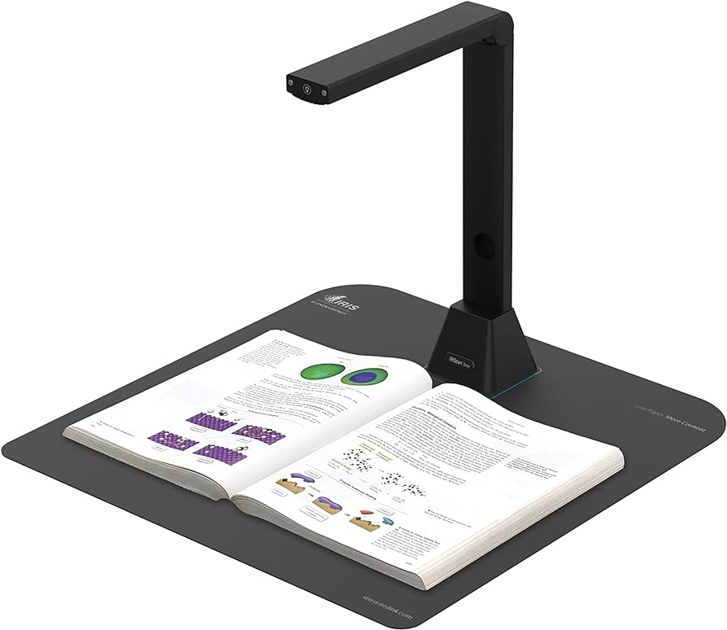

# OpenCV Scanner
 
OpenCV Scanner uses the OpenCV library to scan documents using a Webcam or Camera Scanner.

## Installation
In order to use this program, you need to install *Python* and some dependencies.

### Windows
Download and install Python [here](https://www.python.org/). Or using [*Scoop*](https://github.com/ScoopInstaller/Scoop):
```console
scoop install python
```

After that, install the dependencies:
```console
pip install pillow
pip install opencv-python 
```

### Linux

#### Arch:

```console
sudo pacman -S python
```
and the dependencies:
```console
sudo pacman -S python-pillow
sudo pacman -S python-opencv
```

#### Ubuntu:
```console
sudo apt install python
pip install pillow
pip install opencv-python
```
### Configuration
The settings can be edited in the configs.ini file. This file is created the first time the program is executed.

You need to change the "os" field depending on the OS that you are using (Windows or Linux).

### Usage
```console
python ./main.py
```

### Default controls
- Right Alt: Add page
- Right Control: Save PDF
- f: toggle autofocus
- [ and ] : control manual focus
- u and i: control exposure
- o and p: control brightness
- j and k: control gain
- l and ;: control contrast
- , and .: rotate image
